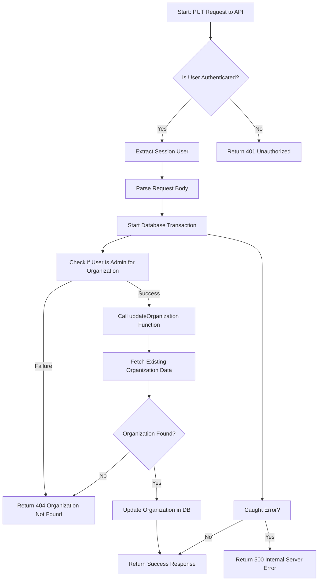

# Next.js API Route for Updating an Organization

## Flow of the Code

### 1. **Authentication Check (`hasAuth`)**
   - First, the request goes through an authentication check to ensure that the user is authorized to make the update request. The result is returned as `authResponse`. If the user is unauthorized, an error response with a 401 status is returned.

### 2. **Extracting Session User**
   - After confirming the user is authenticated, the session user information is extracted from `authResponse`.

### 3. **Processing Request Body**
   - The JSON body of the request is parsed to retrieve the organization data (name, email, contact, short description, billing history, etc.).

### 4. **Starting Transaction**
   - A database transaction (`trx`) is initiated to ensure atomicity of operations (i.e., all database changes occur together).

### 5. **Check Session User for Admin Role (`checkSessionUserForAdmin`)**
   - The transaction checks if the current session user has admin privileges over the organization.

### 6. **Update Organization (`updateOrganization`)**
   - The `updateOrganization` function is then called to update the organization's information in the database. This function first **fetches the existing organization** from the database and then updates the fields based on the provided request body.

   - If the organization does not exist, a 404 response is returned.
   
   - The organization data (name, email, contact, etc.) is **updated**, and the changes are saved.

### 7. **Return Response**
   - If the update succeeds, a success message along with the updated organization details is returned in the response with a 200 status.

### 8. **Error Handling**
   - If any errors occur during this process, they are caught in a `try-catch` block, and an appropriate error message with a 500 status code is returned.

---

## Flowchart Explanation

### Explanation of Flowchart Steps:
1. **Start: PUT Request to API** - The flow begins when a PUT request is made to the API to update an organization.
2. **Is User Authenticated?** - The API checks whether the user is authenticated. If not, a 401 Unauthorized response is returned.
3. **Extract Session User** - If the user is authenticated, session user data is extracted.
4. **Parse Request Body** - The request body is parsed to extract the organization data to be updated.
5. **Start Database Transaction** - A transaction is started to ensure all database changes happen together.
6. **Check if User is Admin for Organization** - The system verifies if the user has admin privileges over the organization.
7. **Call updateOrganization Function** - If the user is authorized, the `updateOrganization` function is called to update the organization.
8. **Fetch Existing Organization Data** - The function fetches the current organization data from the database.
9. **Organization Found?** - If the organization exists, the process continues; otherwise, a 404 response is returned.
10. **Update Organization in DB** - The organization fields are updated with the new data from the request.
11. **Return 200 Success** - The updated organization data is returned with a success message.
12. **Commit Transaction** - The transaction is committed if everything succeeds.
13. **Caught Error?** - If there’s an error, it’s caught and handled, returning a 500 Internal Server Error response if necessary.

This structure ensures a robust process with error handling, role-based validation, and database transaction safety for updating an organization.