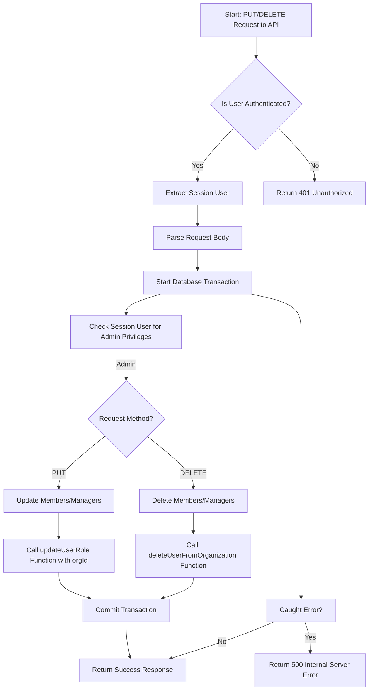

Here’s the flow of your code represented as a **flowchart** and a **detailed step-by-step breakdown**, including the update for `orgId` in the user's role:

### Code Flow for PUT/DELETE Request to Update or Delete Organization Members/Managers

### Step-by-Step Breakdown of the Flowchart:

1. **Start: PUT/DELETE Request to API**
   - The flow begins when a `PUT` or `DELETE` request is made to update or delete members and managers in the organization.

2. **Is User Authenticated?**
   - **Yes**: If the user is authenticated, the process continues to extract the session user details.
   - **No**: If not authenticated, the API responds with a `401 Unauthorized` status.

3. **Extract Session User**
   - Once authenticated, the session user data is extracted from the authentication response for further operations.

4. **Parse Request Body**
   - The body of the request is parsed to retrieve necessary organization data (such as members, managers, and additional details).

5. **Start Database Transaction**
   - A transaction (`trx`) is initiated to handle all database operations within an atomic unit. This ensures either all updates are successfully made or none are applied in case of an error.

6. **Check Session User for Admin Privileges**
   - The system verifies whether the session user has admin privileges for the organization. If the user is not an admin, no further actions are allowed.

7. **Request Method? (PUT or DELETE)**
   - **PUT**: Calls the `updateUsers` function to update the members or managers of the organization.
   - **DELETE**: Calls the `deleteUserFromOrganization` function to remove members or managers from the organization.

8. **Update Members/Managers (PUT)**
   - In the case of a `PUT` request, the `updateUsers` function handles updating the members and managers of the organization.
   - Inside this function, the `updateUserRole` is invoked to update the user role and associate the organization ID (`orgId`) with the user in the `usersTable`.

9. **Delete Members/Managers (DELETE)**
   - In the case of a `DELETE` request, the `deleteUserFromOrganization` function is called to remove users from the organization.

10. **Call `updateUserRole` Function with orgId**
    - When updating members or managers (PUT request), the `updateUserRole` function is called.
    - **Key Addition**: This function now includes updating the `orgId` field in the `usersTable`, ensuring each user is associated with the organization to which they belong and also CHECK IF THE USER IS PART OF ANOTHER organization OR NOT 

11. **Commit Transaction**
    - After successfully updating or deleting users, the transaction is committed, saving all changes to the database.

12. **Return 200 Success with Updated Organization**
    - If everything succeeds, the updated organization data is returned with a `200 Success` status.

13. **Caught Error?**
    - **Yes**: If any error is encountered during the process, the transaction is rolled back, and a `500 Internal Server Error` is returned with the error message.
    - **No**: If no error occurs, a success response is returned with the updated organization details.
